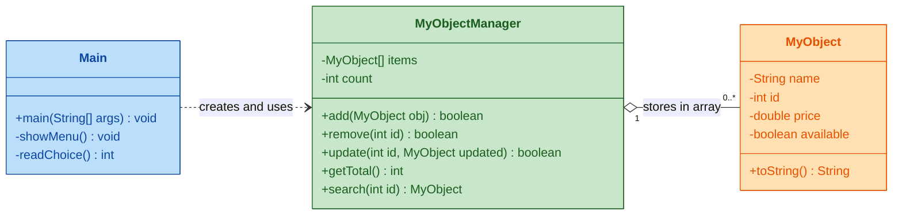
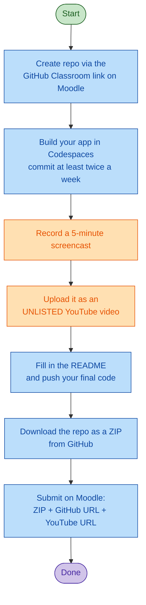

# Object Oriented Computing - Project Assessment

> Build a **console** Java application that manages a collection of custom objects in a **plain array** and demonstrates the **four pillars of OOP**: Encapsulation, Inheritance, Polymorphism and Abstraction.

## ⭐ Start Here

1. **Create your repository.** On Moodle, under the **Project Assessment** section, click the **GitHub Classroom** link. This creates your own copy of this template under the module's GitHub organisation. *(Work only inside this repository - see [Important Notes](#7-important-notes).)*
2. **Open it in GitHub Codespaces.** On your new repository, click **`< > Code` → Codespaces → Create codespace on `main`**. You get a ready-to-go, browser-based VS Code with **Java 21** already installed - nothing to set up on your own machine.
3. **Press run.** Open `src/ie/atu/testpackage/Main.java` and run it. The console menu works from day one; your job is to complete the `TODO`s.

> 💡 This is a **console (text-based) application**. There is no graphical or desktop UI to build - all interaction happens in the terminal.

## 📋 Agenda

| # | Section |
|---|---------|
| ⭐ | [Start Here](#-start-here) |
| 1 | [Introduction](#1-introduction) |
| 2 | [Minimum Project Requirements](#2-minimum-project-requirements) |
| 3 | [Minimum Feature Requirements](#3-minimum-feature-requirements) |
| 4 | [Coding Standards](#4-coding-standards) |
| 5 | [Enhanced Features](#5-enhanced-features) |
| 6 | [Submission Process](#6-submission-process) |
| 7 | [Important Notes](#7-important-notes) |
| 8 | [Grading Rubric](#8-grading-rubric) |

## 1. Introduction

For this project you will design and develop a Java application that demonstrates the **four pillars of OOP** (Encapsulation, Inheritance, Polymorphism and Abstraction). The application manages custom objects of your choice (for example `Car`, `Book` or `Phone`) and stores them in a **plain Java array**.

The template already contains a working console skeleton made of three classes. The diagram below shows how they relate: `Main` (the menu) talks to a `MyObjectManager` (the array store), which holds many `MyObject` instances.



Rename `MyObject` to match the object you choose, then build out the manager and the menu.

## 2. Minimum Project Requirements

- You **must** use this template repository, created from the **GitHub Classroom** link on Moodle. No other setup is acceptable. This repository must contain all documentation, application code and resources (input/output files, images, and so on). **No materials outside this repository are gradable.** Using another GitHub repository, or not using GitHub at all, will **cap your project at 40%**. If you are unsure what this means, email me before you begin.
- Develop your project in **GitHub Codespaces**.
- Track your work with **regular commits** - at minimum **two commits per week** (in practice you should commit many times a day while coding). A sparse commit history may require you to attend a live demonstration; if you fail to attend, the project is **capped at 40%**.
- Complete **every section** of the `README.md`, and add more sections if you wish. It must clearly explain what the application does and how to compile and run it.

## 3. Minimum Feature Requirements

Your application must include, at minimum:

- A custom object with **four instance variables of four different types** (for example `String`, `int`, `double`, `boolean`).
- Clear use of the **four pillars of OOP** (Encapsulation, Inheritance, Polymorphism and Abstraction).
- Methods to **add**, **remove**, **update**, **count the total of**, and **search** objects held in a **plain array**.
- A simple **console menu** that lets the user reach every one of those features.

## 4. Coding Standards

- Your code **must compile** (Java 21).
- Use **consistent formatting** throughout.
- **Comment your code** - at minimum a Javadoc comment on every class and method.
- Keep your documentation and comments **free of spelling and grammar mistakes**.

## 5. Enhanced Features

To aim for a higher grade, go beyond the minimum. For example:

- Add extra methods (for example, list all objects sorted by their unique id) or features (for example, let the user choose the array size at startup). Research these yourself and document them in your `README.md`.
- Record an animated GIF of your application in use and embed it in your `README.md`.
- Produce a runnable `.jar` so the application can be launched on its own, and include it in the repository.

## 6. Submission Process

Follow this process carefully. If you miss any part - **especially the screencast** - you will lose marks.



### 6.1 Screencast Demonstration

- Record a **5-minute** screen capture in which you:
  - give a short code walkthrough, highlighting the parts where you put in the most effort;
  - demonstrate the application running; and
  - point out any extra functionality you added.
- Upload the recording to **YouTube as an _unlisted_ video**, and put the link in your Moodle submission.

> **Why an unlisted YouTube video?** An unlisted video does not appear in search results or on your channel, but **anyone with the link can watch it** - no sign-in, sharing permissions or expiry dates to get wrong. This avoids the access problems we used to hit with MS Stream / OneDrive, where the recording often could not be opened. Just make sure it is set to **Unlisted** (not **Private**).

### 6.2 Moodle Submission

In the Moodle submission area you will find a text box and a file upload. Provide:

- a **ZIP** of your final repository ([how to download a repo ZIP](https://youtube.com/shorts/4bDLccFjQyc?si=dWUDWoW4B_tnADty)),
- the **URL of your GitHub repository**, and
- the **URL of your unlisted YouTube screencast**.

Submit before the due date shown on the Moodle submission link. **Late submissions incur a 10% penalty per day.**

**Sample text-box entry**

```text
Screencast (unlisted YouTube): https://youtu.be/your-video-id
GitHub repository:             https://github.com/DanielCreggOrganization/your-repo-name
```

## 7. Important Notes

1. Only materials within this GitHub repository are graded. *(40% cap if missed.)*
2. Insufficient commits may require a live demonstration. *(40% cap if missed.)*
3. Late submissions incur a 10% penalty per day.

## 8. Grading Rubric

| Area | Poor<br>(0-39) | Fair<br>(40-49) | Good<br>(50-59) | Very Good<br>(60-69) | Excellent<br>(70-100) |
|------|----------------|-----------------|-----------------|----------------------|-----------------------|
| **Console UX** | • Bare template<br>• Minimal effort<br>• Confusing menu<br>• Inconsistent prompts | • Basic effort<br>• Meets minimums<br>• Menu works<br>• Shows competency | • Consistent prompts<br>• Intuitive menu<br>• Beyond basic requirements | • Polished prompts<br>• Helpful feedback<br>• Smooth navigation<br>• Above requirements | • Professional finish<br>• Robust input handling<br>• Flawless flow<br>• Exceeds requirements |
| **Technical** | • Inconsistent code<br>• Unfinished sections<br>• Poor formatting | • Basic competence<br>• No new elements<br>• Meets minimums | • Good structure<br>• Solid use of the 4 pillars<br>• Minor extras | • Professional code<br>• Clean architecture<br>• Consistent style | • Excellence shown<br>• Advanced features<br>• Perfect structure |
| **Docs** | • Bare README<br>• Few commits<br>• Poor submission | • Basic sections done<br>• Sporadic commits<br>• Minimal comments | • Good GitHub usage<br>• Detailed README<br>• Regular commits<br>• Clear comments | • Bespoke content<br>• Clean repo<br>• Detailed docs | • Professional docs<br>• Rich media<br>• Excellent GitHub use<br>• Research depth |
